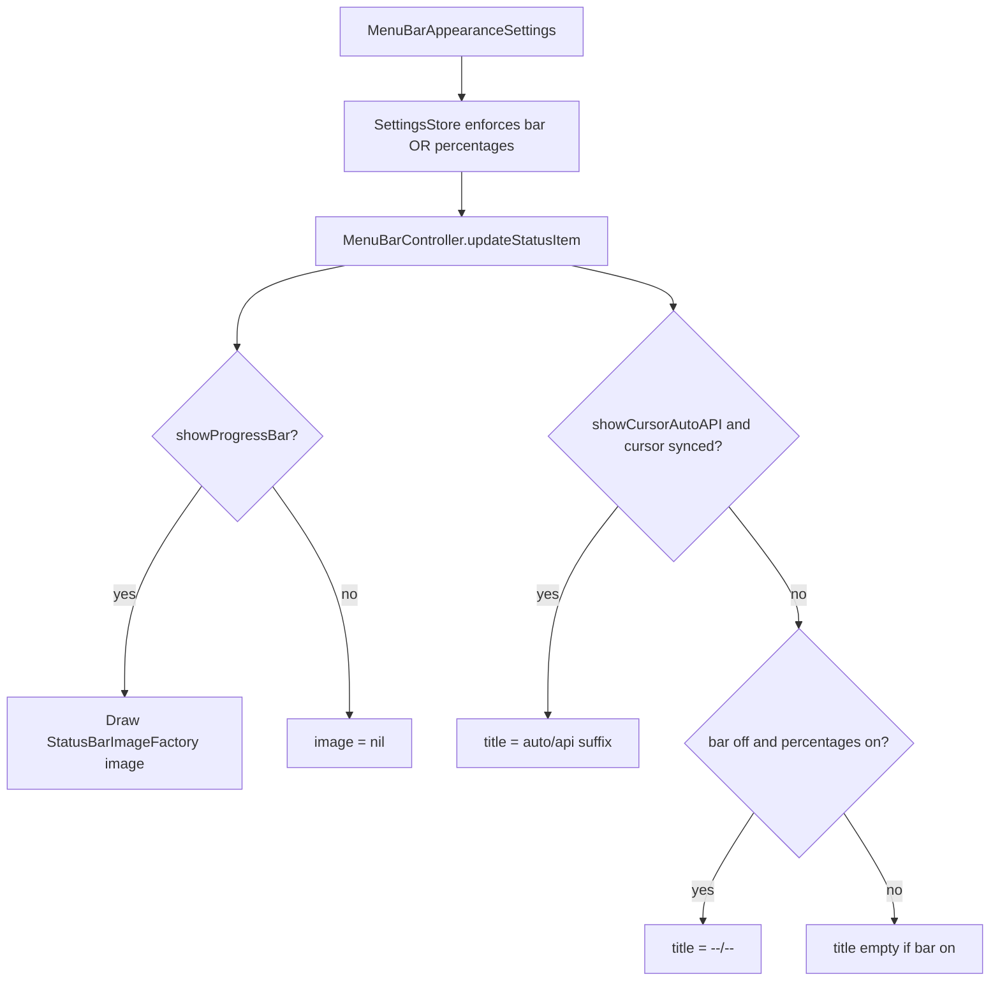

# Disable progress bar with menu bar invariant

## Behavior

| Progress bar | Auto/API % setting | Cursor has sync data | Menu bar shows |
|----------------|-------------------|----------------------|----------------|
| On | Off | any | Progress bar only (today) |
| On | On | yes | Bar + `5.6%/7.8%` |
| On | On | no | Bar only (suffix hidden, as today) |
| Off | On | yes | `5.6%/7.8%` only (title-only layout) |
| Off | On | no | Placeholder `--/--` (per your choice) |
| Off | Off | — | **Not allowed** in settings |

## 1. Centralize menu bar display rules

Add helpers on [`MenuBarAppearanceSettings`](Sources/AIMeter/Core/Models.swift) (or a small `MenuBarDisplayResolver` in Core):

- `var hasAtLeastOneDisplayOption: Bool` — `showProgressBar || showCursorAutoAPIPercentages`
- `func normalized()` — if both flags false, set `showProgressBar = true` (load-time safety for corrupt/legacy prefs)

Remove the unconditional `showProgressBar: true` in [`SettingsStore.swift`](Sources/AIMeter/Storage/SettingsStore.swift) `menuBar.mergedWithDefaults`; replace with `menuBar.normalized()`.

## 2. SettingsStore validation

In [`SettingsStore.swift`](Sources/AIMeter/Storage/SettingsStore.swift):

- Add `setShowProgressBar(_ enabled: Bool)` — if disabling bar while percentages are off, auto-enable `showCursorAutoAPIPercentages` (or reject disable; prefer **auto-enable percentages** so the user’s intent “bar off” still works).
- Update `setShowCursorAutoAPIPercentages(_:)` — if disabling percentages while bar is off, auto-enable `showProgressBar`.

Route both toggles through these setters (not raw struct mutation).

## 3. Settings UI

[`SettingsView.swift`](Sources/AIMeter/UI/SettingsView.swift):

- **General** section: add toggle **Show usage progress bar** (default on), bound to `setShowProgressBar`.
- Optional caption: “Turn off only if Cursor Auto & API percentages are shown in the menu bar.”
- **Cursor** percentages toggle: when progress bar is off, keep it enabled; when user tries to turn percentages off while bar is off, setter forces bar back on (no extra UI needed if setters handle it).
- Optionally `.disabled` on percentages toggle only when it would be the last visible option and bar is already off — simpler to rely on setters only.

## 4. Menu bar rendering

[`MenuBarController.swift`](Sources/AIMeter/UI/MenuBarController.swift) `updateStatusItem`:

- Use resolved flags from settings (post-normalize).
- **Image**: only when `showProgressBar`.
- **Title**:
  - If suffix available (existing `menuBarSuffix` logic) → ` \(suffix)`
  - Else if `!showProgressBar && showCursorAutoAPIPercentages` → ` --/--` (placeholder; trim leading space if no image: `--/--`)
- **Layout**:
  - Image + title → `.imageLeading`
  - Title only → `.noImage` (not `.imageOnly`)
  - Image only → `.imageOnly`

Extract a small `MenuBarDisplay` struct (showImage, titleText) from settings + `DashboardState` to keep `updateStatusItem` readable.

## 5. Tests

Update [`SettingsStoreTests.swift`](Tests/AIMeterTests/SettingsStoreTests.swift):

- Rename/replace `testStoredDisabledProgressBarIsForcedOnDuringMerge`: stored `bar=false, percentages=true` should **remain** `bar=false`.
- Add test: stored `bar=false, percentages=false` normalizes to `bar=true` on load.
- Add tests: `setShowProgressBar(false)` enables percentages when needed; `setShowCursorAutoAPIPercentages(false)` enables bar when needed.

Add focused tests for display resolver (new file or extend existing):

- Bar off + percentages on + no cursor sync → placeholder `--/--`
- Bar off + percentages on + cursor sync → suffix string

## 6. Docs

- One line in [`README.md`](README.md) Highlights if not already sufficient.
- [`CHANGELOG.md`](CHANGELOG.md) Unreleased bullet (CONTRIBUTING expectation for user-visible change).

## Files to touch

| File | Change |
|------|--------|
| [`Models.swift`](Sources/AIMeter/Core/Models.swift) | `normalized()` / invariant on `MenuBarAppearanceSettings` |
| [`SettingsStore.swift`](Sources/AIMeter/Storage/SettingsStore.swift) | `setShowProgressBar`, update merge + `setShowCursorAutoAPIPercentages` |
| [`SettingsView.swift`](Sources/AIMeter/UI/SettingsView.swift) | General toggle |
| [`MenuBarController.swift`](Sources/AIMeter/UI/MenuBarController.swift) | Resolver + placeholder + layout modes |
| [`SettingsStoreTests.swift`](Tests/AIMeterTests/SettingsStoreTests.swift) | Updated/new cases |
| New test file optional | Menu bar display resolution |
| [`README.md`](README.md), [`CHANGELOG.md`](CHANGELOG.md) | Brief notes |
