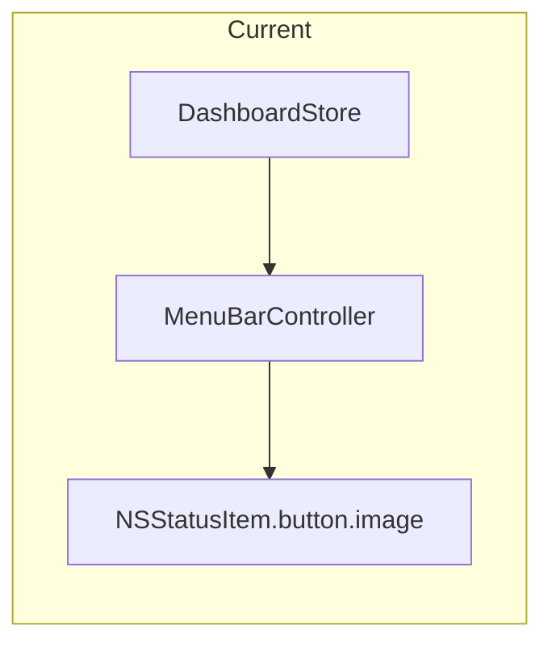
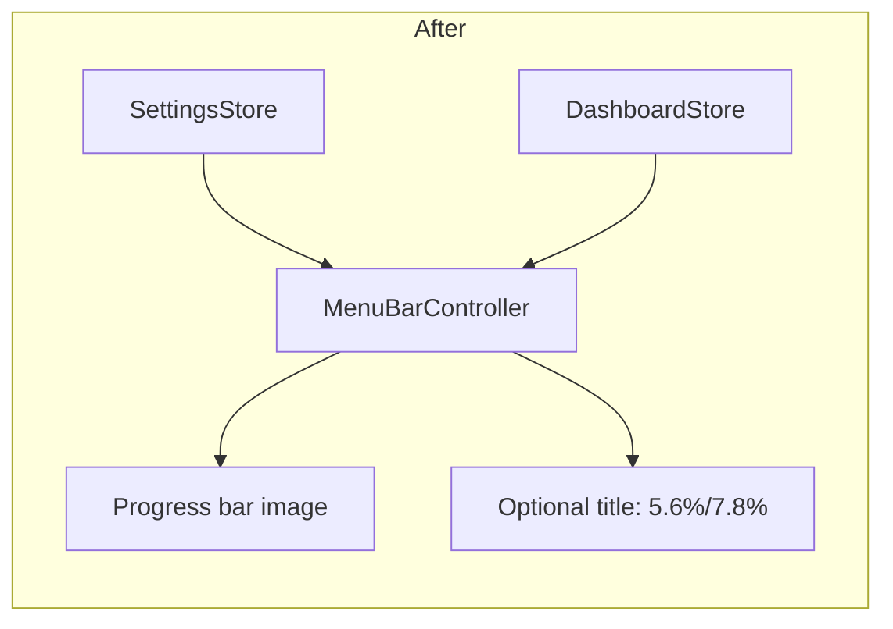

# Menu bar appearance toggles

## Current behavior

The menu bar item is built in [`MenuBarController.swift`](Sources/AIMeter/UI/MenuBarController.swift):

- `imageOnly` mode with a custom 34×16 `NSImage` (blue fill bar + orange/yellow status dot).
- Progress value from [`DashboardState.menuBarProgressPercent`](Sources/AIMeter/Core/Models.swift) (max of connected providers’ primary metric).
- Cursor Auto/API already exist on snapshots as `autoUsedPercent` / `apiUsedPercent` (from secondary metrics).



CHANGELOG notes text was removed in favor of bar-only display; this change reintroduces **optional** text beside the bar, not instead of it.

## Target behavior



| Setting | Default | UI | Menu bar effect |
|---------|---------|-----|-----------------|
| Usage progress bar | `true` | Toggle **on** and **disabled** with caption “Always shown for now” | Unchanged bar (always rendered) |
| Cursor Auto & API percentages | `false` | Normal toggle | When on **and** Cursor is connected with usage data, append `auto%/api%` to the **right** of the image |

**Label format:** one decimal place, slash-separated, percent on each value — e.g. `5.6%/7.8%`. Reuse/clarify formatting in [`DisplayFormatting.swift`](Sources/AIMeter/Core/DisplayFormatting.swift) (add something like `compactPercent(_:)` → `"5.6%"` and `cursorAutoAPISuffix(auto:api:)` → `"5.6%/7.8%"`).

**When to show suffix:** Cursor snapshot `connectionState == .connected` and `fetchedAt != nil` (or `hasSuccessfulSync`). If toggle is on but Cursor is not connected, show image only (no placeholder text).

**Dark mode:** Stop relying on image-only layout for the new text. Set `button.imagePosition = .imageLeading` when suffix is present; use `button.attributedTitle` with `NSColor.labelColor` and `NSFont.monospacedDigitSystemFont(ofSize:weight:)` so text adapts in light/dark menu bars. Clear `title` / `attributedTitle` when suffix is off (restore `imageOnly`).

**Tooltip:** Extend `tooltip(for:)` to append a line like `Cursor Auto: 5.6%, API: 7.8%` when the percentage toggle is enabled and Cursor is connected.

## 1. Settings model and persistence

In [`Models.swift`](Sources/AIMeter/Core/Models.swift), add:

```swift
struct MenuBarAppearanceSettings: Codable, Equatable {
    var showProgressBar: Bool      // default true; not user-offable yet
    var showCursorAutoAPIPercentages: Bool  // default false
}
```

Add `var menuBar: MenuBarAppearanceSettings` to `AppSettings` with:

- Explicit `CodingKeys` + `decodeIfPresent` / defaults (same pattern as `claude` migration).
- `static let default` includes `menuBar: .default`.
- `mergedWithDefaults` in [`SettingsStore.swift`](Sources/AIMeter/Storage/SettingsStore.swift): force `showProgressBar = true` for now so stored `false` cannot disable the bar until you intentionally ship that option.

No setter methods required beyond existing `@Published settings` mutation from SwiftUI bindings (optional thin helpers only if you prefer consistency with `setPollInterval`).

## 2. Settings UI

In [`SettingsView.swift`](Sources/AIMeter/UI/SettingsView.swift), add a **Menu Bar** section (place after **General**, before provider sections):

- **Usage progress bar** — `Toggle` bound to `showProgressBar`, `.disabled(true)`, plus caption explaining it is always on for now.
- **Cursor Auto & API percentages** — `Toggle` bound to `showCursorAutoAPIPercentages`, caption: “Shows Auto and API usage to the right of the menu bar icon (e.g. 5.6%/7.8%).”

Bump [`SettingsWindowController`](Sources/AIMeter/UI/SettingsWindowController.swift) default height slightly (~40pt) so the new section fits without clipping.

## 3. Menu bar rendering

Update [`MenuBarController`](Sources/AIMeter/UI/MenuBarController.swift):

1. Inject `SettingsStore` (constructor + [`AppEnvironment`](Sources/AIMeter/App/AppEnvironment.swift) `menuBarController` init).
2. Subscribe to `settingsStore.$settings` alongside `dashboardStore.$state`; call shared `updateStatusItem(state:settings:)` on either change.
3. In `updateStatusItem`:
   - Always build progress image (existing `StatusBarImageFactory`; `showProgressBar` is always true today but keeps the branch ready).
   - If `settings.menuBar.showCursorAutoAPIPercentages`, set suffix from `state.cursorSnapshot` via `DisplayFormatting.cursorAutoAPISuffix(...)`, configure `imageLeading` + attributed title with small horizontal padding (e.g. `title` baseline alignment; test in dark mode).
   - Else clear title and use `imageOnly`.

Keep `NSStatusItem.variableLength` so the item grows when suffix is enabled.

## 4. Tests

| File | What to add |
|------|-------------|
| [`SettingsStoreTests.swift`](Tests/AIMeterTests/SettingsStoreTests.swift) | Persist/reload `showCursorAutoAPIPercentages`; legacy `AppSettings` JSON without `menuBar` decodes to defaults |
| New small test file or extend `DisplayFormatting` tests | `5.6` + `7.8` → `"5.6%/7.8%"`; whole numbers → `"6%/8%"` if matching existing `DisplayFormatting.percent` rules |

No UI test target exists; manual check: toggle on/off, connected vs disconnected Cursor, light/dark menu bar.

## 5. Docs (optional, minimal)

One line in [`README.md`](README.md) under Highlights or Settings mentioning the optional Auto/API menu bar display. Skip CHANGELOG unless you cut a release.

## Out of scope (future-friendly)

- Disabling the progress bar (model field exists; UI locked on).
- Claude-specific menu bar text.
- Separate toggles for Auto vs API.
- Dark-mode fixes to the blue bar itself (user did not request bar redesign).

## Files to touch

| File | Change |
|------|--------|
| [`Models.swift`](Sources/AIMeter/Core/Models.swift) | `MenuBarAppearanceSettings`, extend `AppSettings` |
| [`SettingsStore.swift`](Sources/AIMeter/Storage/SettingsStore.swift) | Merge defaults for `menuBar` |
| [`SettingsView.swift`](Sources/AIMeter/UI/SettingsView.swift) | Menu Bar section + bindings |
| [`MenuBarController.swift`](Sources/AIMeter/UI/MenuBarController.swift) | Settings injection, image+title layout |
| [`DisplayFormatting.swift`](Sources/AIMeter/Core/DisplayFormatting.swift) | Compact percent / suffix helper |
| [`AppEnvironment.swift`](Sources/AIMeter/App/AppEnvironment.swift) | Pass `settingsStore` into `MenuBarController` |
| [`SettingsWindowController.swift`](Sources/AIMeter/UI/SettingsWindowController.swift) | Slightly taller default window |
| Tests | Settings + formatting |

No XcodeGen/project file changes unless you add a new test file (then run `xcodegen generate`).
